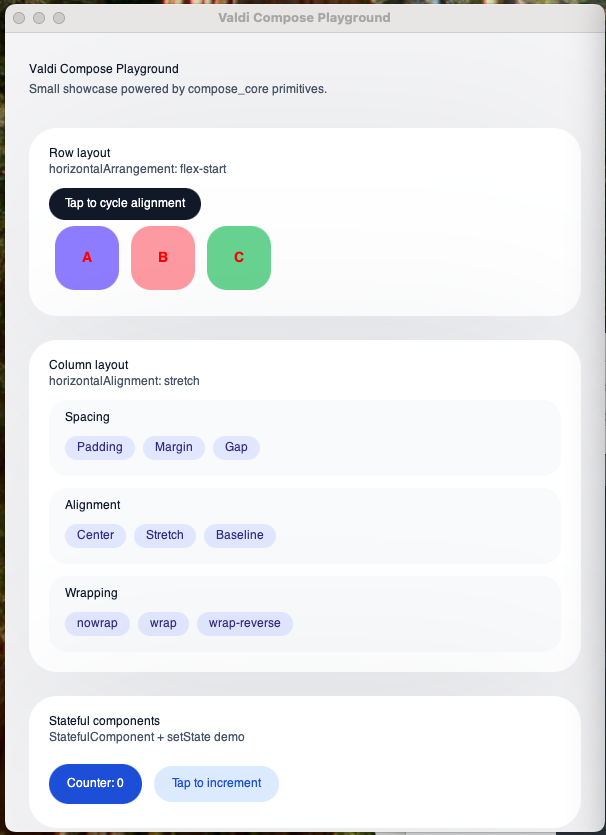

# Valdi Jetpack

Valdi Jetpack is a small playground that ships reusable Compose-style primitives (`compose_core`) and a sample Valdi app (`compose_playground`) to exercise them. It targets the official [Valdi](https://github.com/Snapchat/Valdi) `beta-0.1.1` release at commit `41d6d87643e0b9f9dcd8d7b7c162cf0ac7c969a2`.

## Screenshot


## Prerequisites
- macOS with Xcode command line tools for the macOS/iOS targets.
- Bazelisk (recommended) or Bazel 7.2.1. The checked-in bzlmod graph fetches Valdi and its toolchains reproducibly.
- Android SDK/NDK dependencies are hermetic in Valdi 0.1.x; `adb` is still required to install on a device or emulator.

## Getting started
1) Install dependencies and run the macOS playground:
```sh
bazelisk run //apps/compose_playground:app_macos \
  --snap_flavor=platform_development \
  --@valdi//bzl/valdi:assets_mode=inline \
  --repo_env=VALDI_PLATFORM_DEPENDENCIES=macos
# Equivalent: valdi install macos --application //apps/compose_playground:app_macos
```

2) Build just the Valdi module:
```sh
bazelisk build //valdi_modules/compose_core:compose_core
```

3) Run the native Valdi tests and structural contracts:
```sh
bazelisk test \
  //valdi_modules/compose_core:test \
  //valdi_modules/compose_core:compose_core_placeholder_test \
  //valdi_modules/compose_core:foundation_correctness_test \
  //valdi_modules/compose_core:controlled_controls_contract_test \
  //valdi_modules/compose_core:macos_directory_picker_contract_test \
  //valdi_modules/compose_core:macos_image_export_contract_test
```

## Project layout
- `apps/compose_playground/`: Valdi app entry with `root_component_path = ComposePlaygroundApp@compose_playground/src/ComposePlaygroundApp`.
- `valdi_modules/compose_core/`: Compose-like layout, text/image/card, controlled input, list, fixed-height LazyGrid, and guarded macOS native-action primitives.
- `scripts/`: helper scripts; `log_progress.sh` should be run after meaningful changes.
- `docs/`: parity matrix, notes, and progress log.

## Implementation notes
- `root_component_path` must use the `<Component>@<valdi_module>/src/...` format so the Valdi module loader resolves bundled assets (repository-relative paths will fail at runtime).
- When consuming `compose_core`, import from `compose_core/src/index` to match the generated `.valdimodule` contents.
- TypeScript is strict via `_configs/base.tsconfig.json`; keep exports surfaced through `src/index.ts` files.
- Compose names provide familiar component vocabulary, not a Compose runtime. Valdi has no hooks or `remember`; callers own durable state through `StatefulComponent` and `setState`, while controlled Jetpack components receive values and change callbacks.
- `MODULE.bazel` is the dependency source of truth; `MODULE.bazel.lock` records the resolved graph. There is no legacy WORKSPACE fallback.
- Native directory selection and image export are macOS-only. Other platforms, including desktop web, render explicit unavailable states without instantiating an AppKit custom view.

## Troubleshooting
- The official Valdi 0.1.1 consumer graph currently reports benign bzlmod version-selection warnings for `rules_java` and `rules_jvm_external`; resolution and builds still succeed.
- If Bazel reports permission issues in `/var/tmp/_bazel_*`, ensure your user owns that directory or set `--output_user_root` to a writable path.
- Runtime "No item named ..." errors usually mean the `root_component_path` or import path does not match the bundled module name; verify the two notes above.

## Contributing
- Follow the logging workflow in `AGENTS.md` (`scripts/log_progress.sh "note"` after meaningful work).
- Keep changes small and Bazel targets green; prefer `bazelisk run //apps/compose_playground:app_macos ...` for end-to-end validation when editing UI.
